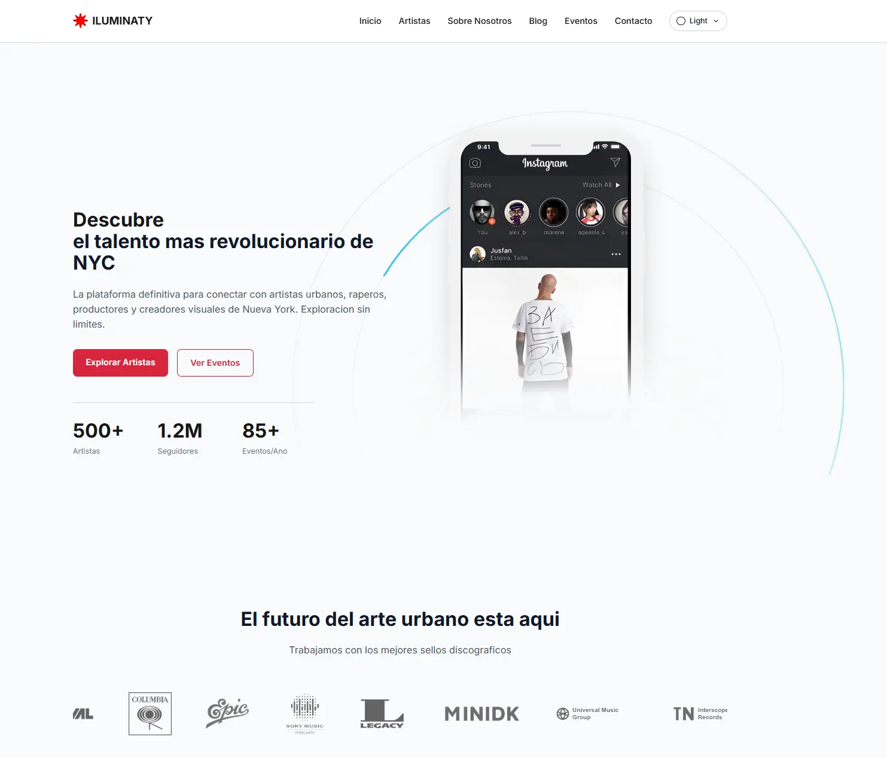

<h1 align="center">
  <span style="display:inline-flex;align-items:center;gap:10px;">
    <svg xmlns="http://www.w3.org/2000/svg" viewBox="0 0 54 54" width="26" height="26" aria-hidden="true">
      <path d="M53.49 28.677c-.8.967-12.539 1.123-13.269 3.477-1.078 3.473 9.212 11 5.7 13.279-4.009 2.607-9.607-6.575-13.744-5.205-3.046 1.009-.414 12.817-5.81 13.285-3.49-1.9-2.19-12.377-4.894-13.288-4.135-1.392-8.762 7.244-13.717 5.659-1.572-4.339 6.691-10.49 5.676-13.725-1.02-3.26-14.931-1-13.3-6.763.778-2.752 12.512-2.549 13.393-3.86C15.468 18.913 3.265 7.929 9.208 6.784c2.686-.517 9.14 7.618 12.283 6.639 3.389-1.055.559-14.595 5.8-13.342 4.738 1.135 1.472 12.447 5.875 13.25 3.54.645 9.474-9.325 12.8-5.155 2.417 3.031-6.208 9.239-5.651 12.3.689 3.778 9.966 2.274 12.3 3.914 1.051.742 1.333 3.731.877 4.282Z" fill="#f90000"></path>
    </svg>
    <span>ILUMINATY</span>
  </span>
</h1>

Professional Vue 3 template for editorial and commercial websites. It includes a blog, app download landing page, profile directory, event promotion, Sanity-ready content and forms ready to connect to Brevo, Mailchimp or any custom backend through webhooks.

Use cases: music platforms, creator directories, editorial websites, event promotion, app launches, creator communities, sports directories, conference sites, startup landing pages and commercial websites powered by a headless CMS.

<p align="center">
  
</p>

<p align="center">
  <a href="https://luynoxrd.github.io/ILUMINATY/"></a>
  <a href="./LICENSE"></a>
  <a href="https://github.com/LuynoxRD"></a>
</p>

<p align="center">
  If this project helps you, consider leaving a star on the repository.
</p>

## Overview

ILUMINATY is a reusable Vue 3 template designed to ship a polished marketing site plus editorial infrastructure without coupling the frontend to one author account or one CMS instance.

This repository is intentionally delivered in two modes:

- `local`: instant demo mode with seeded content and images so the site works immediately after clone
- `sanity`: headless CMS mode using the Sanity adapter already wired in the frontend

The current demo is music-focused, but the architecture is generic. The `artist` model acts as a directory entry model and can be repurposed for creators, athletes, speakers, founders, teams, products or any other profile-based catalog.

## Production Scope

ILUMINATY is ready for production as an SSG template for small to medium editorial sites, landing pages and catalogs.

Operational reality:

- the Sanity integration now fetches large `post` and `event` collections in build-time batches using cursor pagination, which avoids oversized single requests and reduces timeout risk during extraction
- the final SSG build still assembles one complete content snapshot in Node.js memory before pages are rendered
- because of that, this template should be treated as a static-site solution for small to medium volumes, not as an infinite-scale publishing architecture

Practical guidance:

- for most template use cases, this architecture is the correct tradeoff
- once a project approaches six-figure content volumes such as roughly `100,000` posts, events or equivalent route-producing records, reevaluate the architecture instead of assuming SSG will remain comfortable
- the exact ceiling is not guaranteed and depends on content size, route count, build machine RAM and Node.js heap settings
- beyond that range, migrate to a server-rendered or hybrid model that can render pages on demand instead of materializing the full site during build

Current delivery caveats:

- not validated end to end against a live Sanity project in this audit environment
- no automated behavior test suite is bundled by default
- form security and delivery guarantees still depend on the real backend or webhook implementation you connect
- transitive dependency risk still depends on the state of upstream packages in your install graph

## Why Sanity

Sanity is the default CMS in this repository because it solves the hard parts of content operations cleanly:

- structured documents instead of freeform page blobs
- editor-friendly Studio for non-developers
- image hosting and transformations
- flexible schemas for directory entries, events, blog posts and legal pages
- an API model that maps well to a typed Vue application

If the final client is not technical, Sanity is the correct path in this repository because the adapter, document mapping and frontend integration are already implemented. Before production launch, validate the final setup against the real Sanity project and content model you will ship.

## Stack

| Technology | Why it is used |
| --- | --- |
| Vue 3 | Component architecture and reactive UI. |
| Vite | Fast dev server and lean production builds. |
| Vite SSG | Static generation for marketing pages and blog routes. |
| TypeScript | Strong contracts across views, adapters, schemas and services. |
| Tailwind CSS | Fast, consistent utility-first styling. |
| Custom CSS | Brand-specific presentation that should not be forced into utility classes. |
| Vue Router | Marketing routes plus dynamic blog routes. |
| Unhead | SEO meta tags and page head management. |
| GSAP | Motion for hero sections and visual transitions. |
| Lenis | Smooth scrolling. |
| Zod | Runtime validation for content snapshots and form payloads. |
| DOMPurify | Sanitization before form payloads leave the browser. |
| Sanity | Headless CMS adapter already wired. |

## Quick Start

### Requirements

- Node.js 20+ recommended
- npm 10+ recommended

### Install and run

```bash
npm install
npm run dev
```

### Quality checks

```bash
npm run lint
npx vue-tsc --noEmit
```

`npm run lint` validates the codebase without mutating files. Use `npm run lint:fix` when you want ESLint to apply safe autofixes.

Unit and component tests are not bundled by default in this template. If your delivery workflow requires tests, add Vitest or your preferred test runner on top of the existing typed content and adapter architecture.

### Production build

```bash
npm run build
```

The build runs two steps:

1. `scripts/generate-sitemap.mjs` generates `public/sitemap.xml` and `public/robots.txt`
2. `vite-ssg build` renders the static application and blog routes

## Environment Variables

Copy `.env.example` into `.env` and set the values you need.

Core variables:

| Variable | Purpose |
| --- | --- |
| `VITE_SITE_URL` | Canonical site URL used by the frontend, SEO metadata and build base path. Include the subpath if the site is deployed under one, for example `https://example.com/portfolio`. |
| `VITE_CONTENT_SOURCE` | `local` or `sanity`. |
| `VITE_SANITY_PROJECT_ID` | Sanity project id. |
| `VITE_SANITY_DATASET` | Sanity dataset name. |
| `VITE_SANITY_API_VERSION` | Sanity API version. |
| `VITE_SANITY_USE_CDN` | Enables or disables Sanity CDN reads. |
| `VITE_FORM_PROVIDER` | `mock`, `webhook` or `custom` for contact form submissions. |
| `VITE_FORM_ENDPOINT` | Server endpoint for the contact form. |
| `VITE_NEWSLETTER_PROVIDER` | `mock`, `webhook` or `custom` for newsletter and event alerts. |
| `VITE_NEWSLETTER_ENDPOINT` | Server endpoint for newsletter and event alerts. |

Important security rule: never expose private API keys in `VITE_*` variables. Secrets belong in a backend, serverless function or HttpOnly session flow, not in the browser bundle.

Deployment note: the Vite `base` path is derived automatically from `VITE_SITE_URL`. If the site lives at the domain root, use `https://example.com`. If it lives under a subdirectory, include that subdirectory in `VITE_SITE_URL`.

## Theme Modes

The site includes three theme modes:

- `light`
- `dark`
- `system`

The selected mode is stored in `localStorage` under the `iluminaty-theme` key.

Behavior:

- first visit defaults to `system`
- `system` follows the operating system preference
- if the user manually selects `light` or `dark`, that preference persists across sessions until the user selects `system` again
- an anti-flash script in `index.html` applies the right theme before Vue mounts

## Demo Mode vs CMS Mode

### Local mode

This is the default mode for first-run preview and template evaluation.

Content is read from:

- `src/data/pageContent.ts`
- `src/data/artists.ts`
- `src/data/events.ts`
- `src/data/blogPosts.ts`
- `src/data/about.ts`
- `src/data/followers.ts`
- `src/data/assets.ts`

### Sanity mode

When `VITE_CONTENT_SOURCE=sanity`, the frontend loads content through:

- `src/services/content/sanityAdapter.ts`
- `src/services/content/index.ts`
- `src/composables/useContent.ts`
- `src/types/content.ts`
- `src/schemas/content.ts`

Implementation notes:

- the adapter validates the normalized content snapshot with Zod before the app mounts
- `loadContent()` resolves before Vue mounts, so components do not boot against an unresolved remote snapshot
- large `post` and `event` collections are fetched in build-time batches using cursor pagination by `_id`, then sorted in memory for the final snapshot
- the sitemap generator follows the same source selection and uses the same Sanity mode during build

The Sanity adapter already powers:

- home page
- about page
- contact page
- directory page
- events page
- blog page and blog posts
- terms page
- privacy page
- cookies page
- footer and site settings
- featured directory entries on the home page

## Sanity Setup

### 1. Create or open your Sanity project

```bash
npm create sanity@latest
```

### 2. Copy the schemas from this repository

Use the schemas inside:

- `sanity-template/schemaTypes/documents/`
- `sanity-template/schemaTypes/index.ts`

### 3. Configure the frontend

Set your `.env`:

```env
VITE_SITE_URL=https://your-domain.com
VITE_CONTENT_SOURCE=sanity
VITE_SANITY_PROJECT_ID=your_project_id
VITE_SANITY_DATASET=production
VITE_SANITY_API_VERSION=2025-01-01
VITE_SANITY_USE_CDN=true
```

### 4. Run the frontend

```bash
npm run dev
```

### 5. Build static pages

```bash
npm run build
```

Blog routes are generated from the available posts during the build. In `sanity` mode, post discovery for the sitemap and route generation uses batched extraction instead of a fixed hard limit.

## Sanity Document Map

Populate these documents to reflect content across the frontend.

### Global site settings

Document: `siteSettings`

Fill:

- `brandName`
- `footerDescription`
- `footerLinkGroups`
- `footerFollowLabel`
- `footerCopyright`
- `footerCreditPrefix`
- `footerCreditName`
- `footerCreditHref`
- `footerCreditConnector`
- `footerTechnologyName`
- `footerTechnologyHref`
- `footerRepositoryLink`
- `socialProfiles`

This document controls the footer, social links and attribution area, including the `View Repository` button and the `Powered by LuynoxRD and Vue.js` credit line. Replace or remove those values in your fork before publishing your version.

### Home page

Document: `homePage`

Fill:

- `hero`
- `appPreview`
- `labelsSection`
- `highlightCard`
- `featuredArtistsSection`
- `communitySection`
- `faqSection`
- `featuredBlogSection`
- `newsletterSection`
- `appCta`

Home also uses:

- `brandLogo` documents for label or partner logos
- featured directory entries from the `artist` collection
- the latest blog posts from the `post` collection

### About page

Document: `aboutPage`

Fill the hero, mission, values, team intro and manifesto content. Team members themselves are loaded from `teamMember` documents.

### Contact page

Document: `contactPage`

Fill the contact hero, method blocks, FAQ section and call-to-action copy. The contact form itself is powered by the form provider layer described later in this README.

### Directory page

Document: `artistsPage`

Even though the schema name is `artistsPage`, treat it as the directory page configuration for any profile-based catalog.

Fill:

- `heroTitle`
- `heroDescription`
- `filters`
- `genreOptions`
- `neighborhoodOptions`
- `resultsSection`
- `actions`
- `popup`
- `emptyState`

The popup labels for music and social links are also controlled from this document.

### Directory entries

Collection: `artist`

Each document controls one directory profile. Fill:

- `name`
- `genre`
- `bio`
- `locationLabel`
- `image`
- `homeImage`
- `neighborhoods`
- `badge`
- `featured`
- `links.spotify`
- `links.youtube`
- `links.appleMusic`
- `links.instagram`
- `links.tiktok`
- `links.x`
- `links.soundcloud`

How featured entries work on the home page:

- set `featured: true` on the profiles you want to surface
- the frontend reads only featured items
- the home section is capped at 10 entries
- if no featured entries exist in Sanity, the template falls back to local demo entries

### Events page

Document: `eventsPage`

Fill:

- `heroTitle`
- `heroDescription`
- `statsLabels`
- `filters`
- `resultsSubtitle`
- `resultsTitleSuffix`
- `emptyState`
- `purchaseStepsTitle`
- `purchaseSteps`
- `notificationSection`
- `cardLabels`

### Event collection

Collection: `event`

Each event controls:

- `title`
- `description`
- `date`
- `time`
- `doorsOpen`
- `venue`
- `price`
- `artists`
- `isSoldOut`
- `image`
- `ticketUrl`

Frontend behavior:

- if `ticketUrl` exists and `isSoldOut` is `false`, the event is shown as available and the CTA opens the purchase page
- if `isSoldOut` is `true`, the event is rendered as sold out even if a URL exists
- if `ticketUrl` is empty and `isSoldOut` is `false`, the event is rendered as coming soon
- month and venue filters are automatic
- counters are derived from the event collection and keep available, sold out and not-yet-ticketed states separate

### Blog page

Document: `blogPage`

Fill:

- `heroTitle`
- `heroDescription`
- `newsletterSection`
- `post.backLabel`
- `post.shareLabel`
- `post.authorLabel`
- `post.tocLabel`
- `post.relatedEyebrow`
- `post.relatedTitle`
- `post.relatedLinkLabel`
- `post.newsletterEyebrow`
- `post.newsletterTitle`
- `post.newsletterDescription`

### Blog posts

Collection: `post`

Each post controls:

- `title`
- `slug`
- `excerpt`
- `metaDescription`
- `category`
- `date`
- `author`
- `authorBio`
- `imageAlt`
- `readTime`
- `coverImage`
- `tags`
- `contentBlocks`

Supported content blocks:

- heading
- paragraph
- bullet list
- quote
- image block
- embed

### Legal pages

Documents:

- `termsPage`
- `privacyPage`
- `cookiesPage`

Each legal page can be edited from Sanity through:

- `heroTitle`
- `heroDescription`
- `sections`
- `contactCard`
- `footerNote`
- `ctaTitle`
- `ctaDescription`
- `ctaLink`

## How Content Updates Flow to the Site

The frontend consumes one normalized content snapshot. That means all pages read data from a single typed contract, whether the source is local seed data or Sanity.

The flow is:

1. Sanity documents are queried in `src/services/content/sanityAdapter.ts`
2. The adapter maps raw CMS data into the frontend contracts defined in `src/types/content.ts`
3. Zod validates the final snapshot through `src/schemas/content.ts`
4. Vue views read the content through `useContent()`

For large collections, the adapter fetches `post` and `event` documents in batches using cursor pagination rather than a single unbounded query.

Why this matters:

- editors can update copy without touching Vue files
- the frontend stays strongly typed
- switching between local demo content and Sanity does not require rewriting components

## Images

This template has two image pipelines.

### 1. Local demo images

Used in `local` mode and as fallback data.

Managed through:

- `src/assets/`
- `public/data/`
- `src/data/assets.ts`

This includes:

- directory entry demo images
- event demo images
- blog demo covers
- about and team images
- follower and testimonial images
- phone mockup
- default partner logos

### 2. Sanity images

Used in `sanity` mode for editorial content.

The adapter already resolves Sanity image fields to plain URLs for:

- home app preview
- brand logos
- directory entry images
- featured home images
- event images
- blog cover images
- about and team media

If you want every visible image to come from Sanity, upload and fill the corresponding image fields in the mapped documents instead of relying on local fallback assets.

## How to Move from Local Content to Full Sanity Content

If you want the site to be fully driven by Sanity instead of demo seed data:

1. Keep the template in `local` mode while you customize layout and branding
2. Create and register the Sanity Studio schemas from `sanity-template/`
3. Populate all singleton documents:
   - `siteSettings`
   - `homePage`
   - `aboutPage`
   - `contactPage`
   - `artistsPage`
   - `eventsPage`
   - `blogPage`
   - `termsPage`
   - `privacyPage`
   - `cookiesPage`
4. Populate all collections:
   - `artist`
   - `event`
   - `post`
   - `teamMember`
   - `testimonial`
   - `brandLogo`
5. Switch `.env` to `VITE_CONTENT_SOURCE=sanity`
6. Run `npm run dev` and verify each route
7. Run `npx vue-tsc --noEmit` and `npm run build`

The local seed can remain in the repository as demo fallback for future template users. You do not need to delete it unless you want a Sanity-only codebase.

## Forms: Brevo, Mailchimp or Any Backend

This frontend does not send requests directly to Brevo or Mailchimp from the browser, because that would introduce avoidable security vulnerabilities and expose sensitive integration details in the client.

Instead, the project ships a provider layer that supports:

- `mock`
- `webhook`
- `custom`

Relevant files:

- `src/config/forms.ts`
- `src/services/forms/index.ts`
- `src/types/forms.ts`
- `src/schemas/forms.ts`

Existing form surfaces:

- contact form
- blog newsletter
- home newsletter
- event alerts newsletter

Recommended production setup:

1. Frontend submits to your backend or serverless function
2. Backend stores the private API key
3. Backend forwards the payload to Brevo, Mailchimp or any internal CRM
4. Frontend receives a safe success or error response

Client-side sanitization in this template is a hygiene measure, not a trust boundary. The receiving backend must still validate, sanitize and safely persist or forward every payload.

Example:

```env
VITE_FORM_PROVIDER=webhook
VITE_FORM_ENDPOINT=https://your-api.com/forms/contact

VITE_NEWSLETTER_PROVIDER=webhook
VITE_NEWSLETTER_ENDPOINT=https://your-api.com/forms/newsletter
```

## Extending the CMS Layer

Sanity is the production-ready CMS integration included in this repository.

The content layer is adapter-based, so other CMS providers can be added later by implementing the same `ContentAdapter` contract used by the local and Sanity sources.

If your client needs a non-technical editing workflow today, keep Sanity. It is the only fully wired CMS integration in this template at the moment.

## Publishing Checklist for Your Fork

- replace demo branding, copy and media
- update `VITE_SITE_URL`
- populate your Sanity project if you want CMS mode
- validate the real Sanity project end to end before launch
- connect your form endpoints
- replace or remove the footer `View Repository` button
- replace or remove the footer `Powered by LuynoxRD and Vue.js` credit line
- review `siteSettings.socialProfiles`
- confirm featured directory entries on the home page
- run `npm run lint`
- run `npx vue-tsc --noEmit`
- run `npm run build`
- add automated tests if your delivery process requires regression coverage

## Project Structure

```text
src/
  components/        reusable UI blocks
  composables/       content, forms and theme logic
  config/            runtime source and provider selection
  data/              local demo content
  lib/               shared helpers
  schemas/           Zod validators
  services/          CMS and form adapters
  types/             shared frontend contracts
  views/             route-level pages

sanity-template/
  schemaTypes/       ready-to-use Sanity schemas
```

## License

Apache 2.0. See `LICENSE` and `NOTICE`.

This repository is open source and permits reuse, modification and commercial use under Apache License 2.0.

Practical effect:

- redistributed versions must preserve the license and applicable notices
- modified files should be marked as changed when redistributed
- attribution notices in `NOTICE` must travel with qualifying redistributions
- the ILUMINATY name, logo and branding are not granted for trademark use beyond reasonable attribution of origin

Important: Apache 2.0 helps preserve authorship and notices, but it does not prohibit commercial use, resale, forks or large-scale redistribution by itself. If someone wants white-label or OEM-style commercial terms beyond the open source license, contact the author separately.

Made with love by [LuynoxRD](https://luynoxrd.com/) and [Vue.js](https://vuejs.org/) &#x1F49A;
